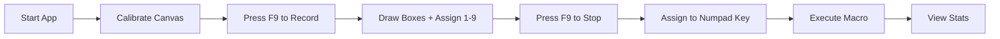
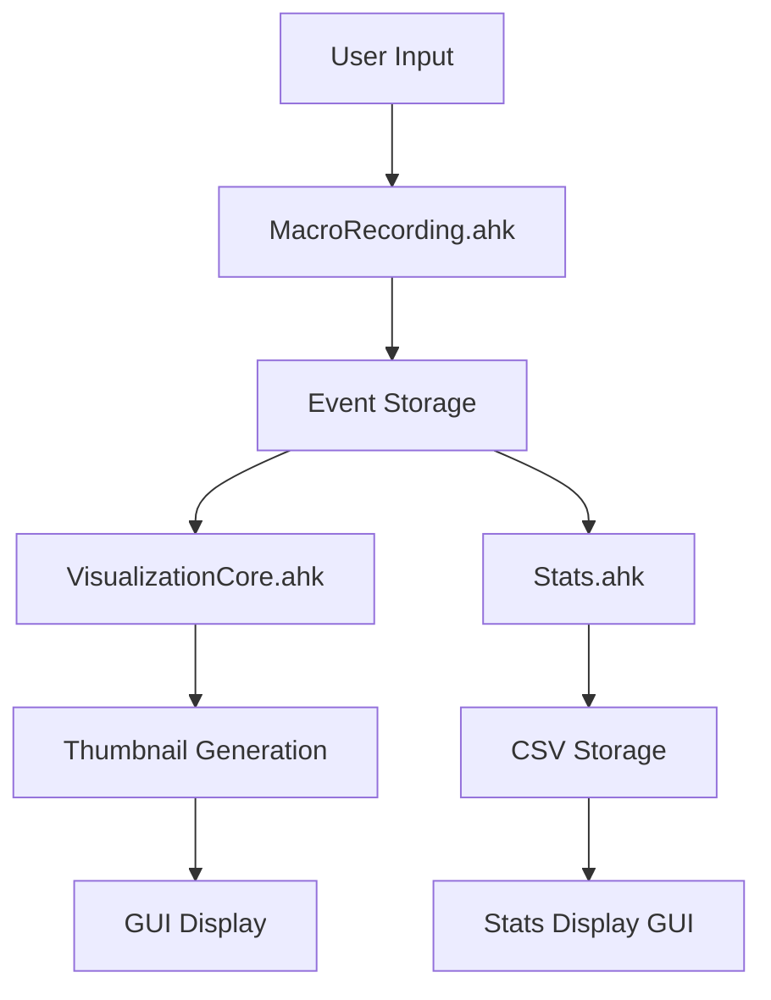

# MacroMaster Z8W

**Advanced AutoHotkey Macro Recording and Playback System for Offline Data Labeling**

[](https://github.com/your-repo/MacroMasterZ8W)
[](https://www.autohotkey.com/)
[](LICENSE)

---

## 🎯 Overview

MacroMaster Z8W is a comprehensive macro recording and playback system designed specifically for offline data labeling workflows. It features a modular architecture with advanced visualization capabilities, real-time statistics tracking, and corporate environment compatibility.

### ✨ Key Features

- **🎥 Advanced Macro Recording**: Record mouse movements, clicks, and keyboard inputs with degradation assignment
- **🎨 Intelligent Visualization**: Three-tier visualization system (HBITMAP, PNG fallbacks)
- **📊 Real-time Analytics**: CSV-powered statistics with today/all-time horizontal display
- **🔧 Dual Canvas Support**: Automatic wide/narrow aspect ratio detection and scaling
- **🏢 Corporate Ready**: Multiple fallback mechanisms for restricted environments
- **⚡ High Performance**: <1ms cached rendering, optimized for 8+ hour sessions
- **🔄 Modular Architecture**: 26 separate components for maintainability
- **📊 Simple Stats Display**: Today and All-Time statistics in horizontal layout
- **📈 CSV-Based Analytics**: Lightweight statistics with degradation breakdowns
- **💾 Permanent Data Storage**: Never-lost historical data with reset protection

### 🚀 Quick Start

#### Requirements
- Windows 10/11
- [AutoHotkey v2.0](https://www.autohotkey.com/v2/)
- 200 MB free disk space

#### Installation

1. **Clone or download** the repository
2. **Run the application:**
   ```bash
   "C:\Program Files\AutoHotkey\v2\AutoHotkey.exe" src/Main.ahk
   ```

#### First Use

1. **Calibrate Canvas**: Click "Calibrate Canvas" and draw around your labeling area
2. **Record Macro**: Press `F9`, draw boxes, press `1-9` for degradations, press `F9` again
3. **Assign & Execute**: Press numpad key to assign, then execute
4. **View Statistics**: Click "Stats" button for today/all-time statistics display

---

## 📖 Documentation

### 📚 Complete Documentation Suite

#### 👥 User Documentation
| Document | Description | Link |
|----------|-------------|------|
| **📖 Usage Guide** | Complete user manual, troubleshooting | [`docs/user-guide/USAGE_GUIDE.md`](docs/user-guide/USAGE_GUIDE.md) |
| **📊 Simple Stats System** | CSV statistics with today/all-time display | [`docs/user-guide/SIMPLE_STATS_SYSTEM.md`](docs/user-guide/SIMPLE_STATS_SYSTEM.md) |

#### 🔧 Developer Documentation
| Document | Description | Link |
|----------|-------------|------|
| **🏗️ Architecture Overview** | System design, data flow, dependencies | [`docs/developer-guide/ARCHITECTURE.md`](docs/developer-guide/ARCHITECTURE.md) |
| **🎨 Visualization System** | Graphics pipeline, canvas handling, HBITMAP/PNG systems | [`docs/developer-guide/VISUALIZATION_SYSTEM.md`](docs/developer-guide/VISUALIZATION_SYSTEM.md) |
| **⚙️ Core System** | State management, initialization, configuration | [`docs/developer-guide/CORE_SYSTEM.md`](docs/developer-guide/CORE_SYSTEM.md) |
| **🤖 AI Development Guide** | Claude Code integration guidelines | [`docs/developer-guide/CLAUDE.md`](docs/developer-guide/CLAUDE.md) |

#### 📁 Project Organization
| Document | Description | Link |
|----------|-------------|------|
| **🗂️ Project Structure** | Directory organization, file locations | [`PROJECT_STRUCTURE.md`](PROJECT_STRUCTURE.md) |
| **✅ Distribution Checklist** | Release verification checklist | [`DISTRIBUTION_CHECKLIST.md`](DISTRIBUTION_CHECKLIST.md) |

### 🎯 Quick Links

- [**Getting Started**](docs/user-guide/USAGE_GUIDE.md#quick-start) - Installation and first run
- [**Basic Workflow**](docs/user-guide/USAGE_GUIDE.md#basic-workflow) - Complete labeling session
- [**Troubleshooting**](docs/user-guide/USAGE_GUIDE.md#troubleshooting) - Common issues and solutions
- [**Project Structure**](PROJECT_STRUCTURE.md) - Navigate the codebase

---

## 🎮 Usage

### Basic Workflow



### Hotkeys

| Hotkey | Function | Context |
|--------|----------|---------|
| `F9` | Toggle recording | Always |
| `Ctrl+B` | Break mode toggle | Always |
| `Numpad 0-9,.,*` | Execute macro | GUI active |
| `Shift+Numpad` | Clear execution | GUI active |
| `Shift+Enter` | Submit image | Browser focus |
| `Numpad /, -` | Change layer | GUI active |
| `RCtrl` | Emergency stop | Always |

### Degradation Types

| Key | Type | Description | Color |
|-----|------|-------------|-------|
| `1` | Smudge | Lens smudges | Orange |
| `2` | Glare | Light glare | Gold |
| `3` | Splashes | Water droplets | Purple |
| `4` | Partial Blockage | Object obstruction | Green |
| `5` | Full Blockage | Complete obstruction | Red |
| `6` | Light Flare | Lens flare | Pink |
| `7` | Rain | Rain drops | Brown |
| `8` | Haze | Atmospheric haze | Gray |
| `9` | Snow | Snow accumulation | Teal |

---

## 🏗️ Architecture

### System Components

```
src/
├── Core.ahk              # System foundation & state management
├── Main.ahk              # Application entry point
├── MacroRecording.ahk    # Event capture & degradation assignment
├── MacroExecution.ahk    # Playback engine & timing control
├── VisualizationCore.ahk # GDI+ operations & bitmap creation
├── VisualizationCanvas.ahk # Canvas detection & scaling
├── Stats.ahk             # CSV statistics tracking
├── GUI*.ahk              # User interface components
└── *-related modules     # Specialized functionality

data/
├── master_stats.csv      # Permanent historical statistics
└── session_stats.csv     # Current session statistics

docs/
├── ARCHITECTURE.md       # System design documentation
├── VISUALIZATION_SYSTEM.md # Graphics pipeline docs
├── CORE_SYSTEM.md        # Core functionality docs
└── USAGE_GUIDE.md        # User manual & troubleshooting
```

### Data Flow



### Key Technologies

- **AutoHotkey v2.0**: Core automation engine
- **GDI+**: Graphics rendering and bitmap operations
- **CSV**: Lightweight, portable data storage

---

## 📊 Statistics & Analytics

### Simple Statistics Display

- **📊 Horizontal Layout**: Today and All-Time statistics side-by-side
- **📈 Degradation Breakdown**: Per-type counts for all 9 degradation types
- **⏱️ Performance Metrics**: Execution times, boxes per hour, efficiency ratios
- **🎯 Usage Analytics**: Most used buttons, active layers, execution types
- **💾 CSV Storage**: Lightweight, portable statistics in CSV format
- **🔄 Reset Protection**: Permanent master stats file preserves all historical data

### CSV Data Format

```csv
timestamp,session_id,button_key,layer,execution_time_ms,total_boxes,smudge,glare,splashes,partial_blockage,full_blockage,light_flare,rain,haze,snow
2025-10-09 10:30:45,session_123,NumpadDot,1,125,5,2,1,0,1,0,0,1,0,0
```

The system maintains two CSV files:
- **session_stats.csv**: Current session data (resets on startup)
- **master_stats.csv**: Permanent historical data (never deleted)

---

## 🔧 Development

### Prerequisites

- AutoHotkey v2.0 development environment
- Git for version control
- VS Code with AHK extension (recommended)

### Building

```bash
# Clone repository
git clone https://github.com/your-repo/MacroMasterZ8W.git
cd MacroMasterZ8W

# Start development
"C:\Program Files\AutoHotkey\v2\AutoHotkey.exe" src/Main.ahk
```

### Testing

```bash
# Run AHK syntax check
"C:\Program Files\AutoHotkey\v2\AutoHotkey.exe" /ErrorStdOut src/Main.ahk

# Verify stats recording
type data\session_stats.csv
type data\master_stats.csv
```

### Contributing

1. Fork the repository
2. Create a feature branch (`git checkout -b feature/amazing-feature`)
3. Commit changes (`git commit -m 'Add amazing feature'`)
4. Push to branch (`git push origin feature/amazing-feature`)
5. Open a Pull Request

---

## 🏢 Corporate Environment

### Enterprise Features

- **🔒 No External Dependencies**: All components self-contained
- **📁 Multiple Fallback Paths**: Automatic directory detection
- **🔄 Silent Degradation**: Continues working with reduced features
- **🚫 No Network Required**: Complete offline operation
- **🔧 Group Policy Compatible**: Works with standard restrictions

### Deployment Considerations

- **Per-User Installation**: Isolated data directories
- **Automatic Fallbacks**: Corporate path restrictions handled
- **Memory Efficient**: Optimized for long sessions
- **Error Resilient**: Graceful failure handling

---

## 📈 Performance

### Benchmarks

| Operation | Performance | Notes |
|-----------|-------------|-------|
| **HBITMAP Rendering** | <1ms cached, 5-10ms new | Per thumbnail |
| **Macro Execution** | 50-500ms | Depends on complexity |
| **Stats Display** | <100ms | CSV parsing and GUI rendering |
| **CSV Write** | <10ms | Per execution record |
| **Application Startup** | 2-5s | Cold start |

### System Requirements

- **Minimum**: 4GB RAM, Dual-core CPU, 200MB storage
- **Recommended**: 8GB RAM, Quad-core CPU, 500MB storage
- **Optimal**: 16GB RAM, Modern CPU, SSD storage

---

## 🐛 Troubleshooting

### Common Issues

**Application won't start:**
```bash
# Check AutoHotkey installation
"C:\Program Files\AutoHotkey\v2\AutoHotkey.exe" --version

# Check syntax errors
"C:\Program Files\AutoHotkey\v2\AutoHotkey.exe" /ErrorStdOut src/Main.ahk
```

**Black thumbnails:**
- Check canvas calibration
- Verify GDI+ initialization
- Clear HBITMAP cache

**Statistics not recording:**
- Check file permissions
- Verify break mode is off
- Test CSV write access

**Slow performance:**
- Clear visualization cache
- Optimize macro complexity
- Check memory usage

### Debug Mode

```autohotkey
; Enable debug output in Core.ahk
UpdateStatus("Debug: GDI+ = " . gdiPlusInitialized)
UpdateStatus("Debug: Canvas = " . isCanvasCalibrated)
UpdateStatus("Debug: Cache size = " . hbitmapCache.Count)
```

### Emergency Recovery

```autohotkey
; Complete system reset
EmergencyStop()        ; Halt all operations
CleanupHBITMAPCache()  ; Clear memory
ForceStateReset()      ; Reset state
; Restart application
```

---

## 📝 License

This project is licensed under the MIT License - see the [LICENSE](LICENSE) file for details.

---

## 🙏 Acknowledgments

- **AutoHotkey Community**: For the powerful automation framework
- **GDI+ Team**: For the graphics rendering library
- **Open Source Community**: For the tools and libraries that make this possible

---

## 📞 Support

### Documentation
- 📖 [Complete Usage Guide](docs/user-guide/USAGE_GUIDE.md)
- 🏗️ [Architecture Documentation](docs/developer-guide/ARCHITECTURE.md)
- 🎨 [Visualization System](docs/developer-guide/VISUALIZATION_SYSTEM.md)
- ⚙️ [Core System Details](docs/developer-guide/CORE_SYSTEM.md)
- 📊 [Simple Stats System](docs/user-guide/SIMPLE_STATS_SYSTEM.md)
- 🗂️ [Project Structure](PROJECT_STRUCTURE.md)

### Issue Reporting
- 🐛 [GitHub Issues](https://github.com/your-repo/MacroMasterZ8W/issues)
- 📧 Check documentation first
- 🔍 Search existing issues
- 📝 Provide detailed reproduction steps

### Feature Requests
- 💡 [GitHub Discussions](https://github.com/your-repo/MacroMasterZ8W/discussions)
- 📋 Use issue templates
- 🎯 Be specific about use cases
- 📊 Include performance impact analysis

---

## 🔄 Version History

### v2.0 (Current)
- ✅ Complete modular architecture
- ✅ Three-tier visualization system
- ✅ Simple CSV statistics with today/all-time display
- ✅ Dual-write recording (CSV + permanent master file)
- ✅ Never-lost historical data protection
- ✅ Corporate environment support
- ✅ Comprehensive documentation

### v1.x Legacy
- ✅ Basic macro recording/playback
- ✅ CSV statistics tracking
- ✅ Single canvas support
- ✅ Core functionality

---

**MacroMaster Z8W** - Transforming offline data labeling workflows with intelligent automation and comprehensive analytics.

---

*Built with ❤️ using AutoHotkey v2.0 and GDI+*