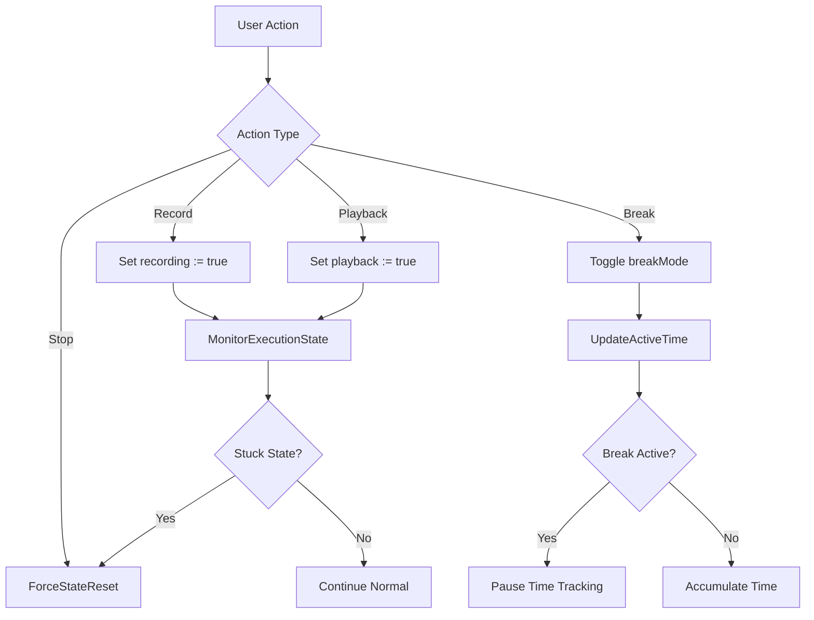

# MacroMaster Core System - Complete Documentation

**Version:** 2.0
**Last Updated:** 2025-10-08
**Status:** Production Ready

---

## Table of Contents

1. [Overview](#overview)
2. [System Architecture](#system-architecture)
3. [Core Variables & Configuration](#core-variables--configuration)
4. [Initialization System](#initialization-system)
5. [Macro Management](#macro-management)
6. [Canvas & Visualization](#canvas--visualization)
7. [Time Tracking & Break Mode](#time-tracking--break-mode)
8. [Statistics System](#statistics-system)
9. [Configuration Management](#configuration-management)
10. [Error Handling & Safety](#error-handling--safety)
11. [Performance Optimization](#performance-optimization)
12. [Usage Guide](#usage-guide)
13. [Troubleshooting](#troubleshooting)

---

## Overview

The MacroMaster Core System is the central nervous system of the application, managing all global state, initialization, configuration, and core functionality. It coordinates between the modular AHK components and provides the foundation for macro recording, playback, and visualization.

### Key Features

- **Modular Architecture**: 20+ separate AHK modules with clear separation of concerns
- **State Management**: Comprehensive global state tracking for all system components
- **Initialization Pipeline**: Robust startup sequence with error handling and fallbacks
- **Configuration System**: Persistent settings with INI file storage
- **Time Tracking**: Session and break mode management
- **Statistics Integration**: Real-time stats collection and CSV export
- **Corporate Safety**: Multiple fallback paths and error recovery
- **Performance Monitoring**: Built-in health checks and optimization

### Core Responsibilities

1. **System Initialization**: Safe startup with dependency checking
2. **State Coordination**: Managing recording/playback/break states
3. **Resource Management**: Memory, hooks, and GUI lifecycle
4. **Configuration Persistence**: Settings storage and restoration
5. **Statistics Collection**: Performance metrics and usage tracking
6. **Error Recovery**: Graceful failure handling and system reset

---

## System Architecture

### Module Structure

```
src/Core.ahk (Main Controller)
├── Initialization System
│   ├── Main() - Startup orchestrator
│   ├── InitializeVariables() - State setup
│   ├── InitializeDirectories() - Path creation
│   └── InitializeVisualizationSystem() - GDI+ setup
├── State Management
│   ├── Global Variables - System state
│   ├── ForceStateReset() - Emergency recovery
│   └── MonitorExecutionState() - Health monitoring
├── Configuration System
│   ├── LoadConfig() - Settings restoration
│   ├── SaveConfig() - Settings persistence
│   └── ValidateConfigIntegrity() - Data validation
├── Macro Management
│   ├── CountLoadedMacros() - Statistics
│   ├── ClearHBitmapCacheForMacro() - Cache management
│   └── macroEvents Map - Storage coordination
└── Utility Functions
    ├── CleanupAndExit() - Graceful shutdown
    ├── AutoSave() - Background persistence
    └── EmergencyStop() - Safety override
```

### Global State Variables

#### Execution State
```autohotkey
global recording := false          ; Currently recording macro
global playback := false           ; Currently playing back macro
global awaitingAssignment := false ; Waiting for macro assignment
global lastExecutionTime := 0      ; Timestamp of last execution
global playbackStartTime := 0      ; When current playback started
```

#### System Configuration
```autohotkey
global mainGui := 0                 ; Main application window
global statusBar := 0               ; Status display control
global currentLayer := 1            ; Active layer (1-5)
global totalLayers := 5             ; Total available layers
global darkMode := true             ; UI theme setting
```

#### Performance & Optimization
```autohotkey
global hbitmapCache := Map()        ; Visualization cache
global liveStatsGui := 0            ; Real-time stats window
global liveStatsTimer := 0          ; Stats update timer
global chromeMemoryCleanupCount := 0 ; Memory management counter
```

---

## Core Variables & Configuration

### Global Configuration Map

| Category | Variable | Default | Description |
|----------|----------|---------|-------------|
| **Hotkeys** | `hotkeyRecordToggle` | `"F9"` | Start/stop macro recording |
| | `hotkeySubmit` | `"+Enter"` | Submit current image |
| | `hotkeyDirectClear` | `"NumpadEnter"` | Clear without degradation |
| | `hotkeyEmergency` | `"RCtrl"` | Emergency stop |
| | `hotkeyBreakMode` | `"^b"` | Toggle break mode |
| **Timing** | `boxDrawDelay` | `75` | Delay between box draws (ms) |
| | `mouseClickDelay` | `85` | Mouse click timing (ms) |
| | `keyPressDelay` | `20` | Keyboard press timing (ms) |
| | `betweenBoxDelay` | `200` | Delay between boxes (ms) |
| **Canvas** | `canvasWidth` | `1920` | Default canvas width |
| | `canvasHeight` | `1080` | Default canvas height |
| | `canvasType` | `"wide"` | Current canvas type |
| **Recording** | `mouseMoveThreshold` | `3` | Mouse movement sensitivity |
| | `mouseMoveInterval` | `12` | Mouse polling interval (ms) |
| **UI** | `windowWidth` | `1200` | Main window width |
| | `windowHeight` | `800` | Main window height |

### Degradation System

#### Degradation Types
```autohotkey
global degradationTypes := Map(
    1, "smudge", 2, "glare", 3, "splashes",
    4, "partial_blockage", 5, "full_blockage",
    6, "light_flare", 7, "rain", 8, "haze", 9, "snow"
)
```

#### Color Mapping
```autohotkey
global degradationColors := Map(
    1, 0xFF4500,  ; smudge - orangered
    2, 0xFFD700,  ; glare - gold
    3, 0x8A2BE2,  ; splashes - blueviolet
    4, 0x00FF32,  ; partial_blockage - limegreen
    5, 0x8B0000,  ; full_blockage - darkred
    6, 0xFF1493,  ; light_flare - deeppink
    7, 0xB8860B,  ; rain - darkgoldenrod
    8, 0x556B2F,  ; haze - darkolivegreen
    9, 0x00FF7F   ; snow - springgreen
)
```

### Layer System

#### Layer Configuration
```autohotkey
global layerNames := ["Base", "Advanced", "Tools", "Custom", "AUTO", "JSON", "Thumbnails", "Settings", "Layer9", "Layer10"]
global layerBorderColors := ["0x404040", "0x505050", "0x606060", "0x707070", "0x808080"]
```

#### Layer Purposes
- **Layer 1 (Base)**: Fundamental macros
- **Layer 2 (Advanced)**: Complex workflows
- **Layer 3 (Tools)**: Utility functions
- **Layer 4 (Custom)**: User-defined macros
- **Layer 5 (AUTO)**: Automated sequences
- **Layer 6 (JSON)**: Annotation profiles
- **Layer 7+**: Extended functionality

---

## Initialization System

### Main Initialization Flow

#### `Main()` - Primary Startup Function

**Purpose:** Orchestrates complete system initialization with error handling

**Initialization Sequence:**
1. **Directory Setup**: `InitializeDirectories()`
2. **Config System**: `InitializeConfigSystem()`
3. **Variable Setup**: `InitializeVariables()`
4. **Canvas System**: `InitializeCanvasVariables()`
5. **CSV System**: `InitializeCSVFile()`
6. **Stats System**: `InitializeStatsSystem()`
7. **Offline Data**: `InitializeOfflineDataFiles()`
8. **JSON Annotations**: `InitializeJsonAnnotations()`
9. **Visualization**: `InitializeVisualizationSystem()`
10. **Hotkeys**: `InitializeWASDHotkeys()`
11. **GUI Creation**: `InitializeGui()`
12. **Settings Load**: `LoadConfig()`
13. **UI Updates**: `ApplyLoadedSettingsToGUI()`
14. **Timers**: Setup monitoring and auto-save
15. **Cleanup**: Register exit handlers

**Error Handling:**
- Each initialization step wrapped in try/catch
- Status updates for debugging
- Graceful degradation on failures
- Application exit on critical failures

#### `InitializeDirectories()` - Path Creation

**Purpose:** Creates required directory structure with corporate-safe fallbacks

**Directory Structure:**
```
Documents\MacroMaster\
├── data\              # Configuration and stats
├── thumbnails\        # Button visualization cache
└── stats_dashboard.html  # Analytics dashboard
```

**Fallback Strategy:**
1. Primary: `A_MyDocuments\MacroMaster\`
2. Fallback 1: `A_ScriptDir\MacroMaster\`
3. Fallback 2: `A_MyDocuments\MacroMaster_fallback\`
4. Fallback 3: `EnvGet("USERPROFILE")\MacroMaster\`
5. Fallback 4: `A_Desktop\MacroMaster\`

#### `InitializeVariables()` - State Setup

**Purpose:** Sets up all global variables to safe defaults

**Key Initializations:**
- Button custom labels mapping
- Severity breakdown tracking
- Session timing variables
- Degradation tracking state

---

## Macro Management

### Macro Storage System

#### Global Storage Maps
```autohotkey
global macroEvents := Map()           ; Layer.Button → Event Array
global buttonGrid := Map()            ; Button → GUI Control
global buttonLabels := Map()          ; Button → Display Label
global buttonPictures := Map()        ; Button → Picture Control
global buttonCustomLabels := Map()    ; Button → Custom Label
```

#### Storage Key Format
```
"L{layer}_{buttonName}"
Examples:
- "L1_Num7"     (Layer 1, Numpad 7)
- "L3_NumMult"  (Layer 3, Numpad Multiply)
- "L5_Num0"     (Layer 5, Numpad 0)
```

#### `CountLoadedMacros()` - Statistics Function

**Purpose:** Counts total macros across all layers

**Algorithm:**
```autohotkey
macroCount := 0
Loop Integer(totalLayers) {
    layer := A_Index
    for buttonName in buttonNames {
        layerMacroName := "L" . layer . "_" . buttonName
        if (macroEvents.Has(layerMacroName) && macroEvents[layerMacroName].Length > 0) {
            macroCount++
        }
    }
}
return macroCount
```

### Cache Management

#### `ClearHBitmapCacheForMacro(macroName)`

**Purpose:** Removes cached visualizations for specific macro

**Implementation:**
```autohotkey
keysToDelete := []
for cacheKey, hbitmap in hbitmapCache {
    if (InStr(cacheKey, macroName)) {
        keysToDelete.Push(cacheKey)
        DllCall("DeleteObject", "Ptr", hbitmap)  ; Clean up handle
    }
}
for key in keysToDelete {
    hbitmapCache.Delete(key)
}
```

#### `CleanupHBITMAPCache()` - Global Cache Cleanup

**Purpose:** Releases all cached HBITMAP handles

**Used:** During application shutdown and memory cleanup

---

## Canvas & Visualization

### Dual Canvas System

#### Canvas Variables
```autohotkey
; Wide canvas (16:9)
global wideCanvasLeft := 0, wideCanvasTop := 0
global wideCanvasRight := 1920, wideCanvasBottom := 1080

; Narrow canvas (4:3 centered)
global narrowCanvasLeft := 240, narrowCanvasTop := 0
global narrowCanvasRight := 1680, narrowCanvasBottom := 1080

; Legacy canvas
global userCanvasLeft := 0, userCanvasTop := 0
global userCanvasRight := 1920, userCanvasBottom := 1080
```

#### Canvas Calibration Flags
```autohotkey
global isCanvasCalibrated := false
global isWideCanvasCalibrated := false
global isNarrowCanvasCalibrated := false
global lastCanvasDetection := ""
```

### Canvas Functions

#### `DetectCanvasType()` - Aspect Ratio Detection

**Purpose:** Determines canvas type from dimensions

**Algorithm:**
```autohotkey
canvasAspectRatio := canvasWidth / canvasHeight

narrowAspectRatio := 1330 / 1060  ; ≈ 1.25
wideAspectRatio := 1884 / 1057    ; ≈ 1.78

tolerance := 0.15  ; 15% tolerance

if (Abs(canvasAspectRatio - narrowAspectRatio) < tolerance) {
    canvasType := "narrow"
} else if (Abs(canvasAspectRatio - wideAspectRatio) < tolerance) {
    canvasType := "wide"
} else {
    canvasType := "custom"
}
```

#### Canvas Calibration Wrappers
- `CalibrateCanvasArea()` → `Canvas_Calibrate("user")`
- `CalibrateWideCanvasArea()` → `Canvas_Calibrate("wide")`
- `CalibrateNarrowCanvasArea()` → `Canvas_Calibrate("narrow")`
- `ResetCanvasCalibration()` → `Canvas_Reset("user")`

---

## Time Tracking & Break Mode

### Time Management Variables

```autohotkey
global applicationStartTime := A_TickCount    ; App launch time
global totalActiveTime := 0                   ; Total productive time
global lastActiveTime := A_TickCount          ; Last activity timestamp
global breakMode := false                     ; Break mode state
global breakStartTime := 0                    ; Break start time
```

### Break Mode System

#### Purpose
- Tracks productive vs break time
- Pauses statistics during breaks
- Provides time management for labeling workflows

#### `UpdateActiveTime()` - Time Accumulation

**Purpose:** Updates total active time counter

**Algorithm:**
```autohotkey
if (!breakMode) {
    currentTime := A_TickCount
    timeDiff := currentTime - lastActiveTime
    if (timeDiff > 0 && timeDiff < 300000) {  ; Max 5 minutes to prevent errors
        totalActiveTime += timeDiff
    }
    lastActiveTime := currentTime
}
```

#### Break Mode Toggle
- Hotkey: `Ctrl+B`
- GUI Button: Break mode toggle
- Effect: Pauses time tracking and stats collection

### Session Management

#### Session Variables
```autohotkey
global sessionId := "sess_" . FormatTime(A_Now, "yyyyMMdd_HHmmss")
global currentUsername := A_UserName
global dailyResetActive := false
global sessionStartTime := 0
global clearDegradationCount := 0
```

---

## Statistics System

### CSV Statistics Integration

#### File Paths
```autohotkey
global masterStatsCSV := workDir . "\master_stats.csv"
global permanentStatsFile := workDir . "\master_stats_permanent.csv"
```

#### Stats Collection Functions
- `RecordExecutionStats()` - Captures macro execution data
- `AppendToCSV()` - Writes to CSV with dual-write to database
- `ReadStatsFromCSV()` - Loads historical data

### Real-time Dashboard Integration

#### Dashboard Variables
```autohotkey
global ingestionServiceUrl := "http://localhost:5001"
global currentSessionId := "sess_" . FormatTime(A_Now, "yyyyMMdd_HHmmss")
global realtimeEnabled := true
```

#### Production Stats System
```autohotkey
global statsQueue := []           ; Pending stats writes
global statsWorkerActive := false  ; Background worker status
global statsErrorCount := 0        ; Error tracking
global lastHealthCheck := 0        ; Health monitoring
global systemHealthStatus := "healthy"
```

### Offline Data Storage

#### Offline Variables
```autohotkey
global persistentDataFile := workDir . "\persistent_data.json"
global dailyStatsFile := workDir . "\daily_stats.json"
global offlineLogFile := workDir . "\offline_log.txt"
global dataQueue := []            ; Offline data queue
```

---

## Configuration Management

### Configuration File System

#### Config File Location
```autohotkey
global configFile := workDir . "\config.ini"
```

#### Configuration Sections
- `[Settings]` - General application settings
- `[Macros]` - Macro storage and assignments
- `[Canvas]` - Canvas calibration data
- `[Hotkeys]` - Custom hotkey mappings

### Load/Save Functions

#### `LoadConfig()` - Configuration Restoration

**Purpose:** Loads all settings from INI file

**Process:**
1. Read INI file sections
2. Parse settings into global variables
3. Update GUI controls to match loaded values
4. Apply loaded canvas calibrations
5. Restore layer and mode settings

#### `SaveConfig()` - Configuration Persistence

**Purpose:** Saves current settings to INI file

**Process:**
1. Gather current global variable values
2. Write to INI file sections
3. Handle file locking and atomic writes
4. Update status on success/failure

#### `ValidateConfigIntegrity()` - Data Validation

**Purpose:** Periodic validation of configuration file

**Checks:**
- File existence and size
- Basic structure validation
- Critical setting ranges
- Runs every 2 minutes via timer

---

## Error Handling & Safety

### Emergency Systems

#### `EmergencyStop()` - Safety Override

**Purpose:** Immediate halt of all system activity

**Actions:**
1. Update status: "🚨 EMERGENCY STOP"
2. Force state reset
3. Stop all timers
4. Release mouse/keyboard hooks
5. Send emergency key releases
6. Reset mouse/keyboard delays

#### `ForceStateReset()` - State Recovery

**Purpose:** Clears stuck states and resets system

**Reset Actions:**
- `recording := false`
- `playback := false`
- `awaitingAssignment := false`
- Stop auto execution
- Clean up hooks and timers
- Reset stuck mouse/key states

### Health Monitoring

#### `MonitorExecutionState()` - State Validation

**Purpose:** Detects and recovers from stuck states

**Checks:**
- Playback stuck (>30 seconds)
- Recording stuck (>5 minutes)
- Runs every 15 seconds

#### `ValidateConfigIntegrity()` - Config Validation

**Purpose:** Ensures configuration file integrity

**Validations:**
- File exists and readable
- Reasonable file size
- Contains required sections
- Runs every 2 minutes

### Safe Cleanup

#### `CleanupAndExit()` - Graceful Shutdown

**Purpose:** Proper resource cleanup on exit

**Cleanup Sequence:**
1. Stop all timers
2. Uninstall hooks
3. Clean HBITMAP cache
4. Save configuration
5. Aggregate final metrics

---

## Performance Optimization

### Memory Management

#### HBITMAP Cache Optimization
- Automatic cleanup on macro changes
- Handle release to prevent memory leaks
- Size monitoring and warnings

#### Chrome Memory Cleanup
```autohotkey
global chromeMemoryCleanupCount := 0
global chromeMemoryCleanupInterval := 50

; Trigger cleanup every 50 executions
if (chromeMemoryCleanupCount >= chromeMemoryCleanupInterval) {
    ; Memory cleanup logic
    chromeMemoryCleanupCount := 0
}
```

### Timer Management

#### Active Timers
- `UpdateActiveTime` - 30 seconds (time tracking)
- `AutoSave` - 30 seconds (configuration)
- `MonitorExecutionState` - 15 seconds (health)
- `ValidateConfigIntegrity` - 120 seconds (config check)

### Auto-save System

#### `AutoSave()` - Background Persistence

**Purpose:** Prevents data loss during long sessions

**Logic:**
```autohotkey
if (!recording && !breakMode) {
    try {
        SaveConfig()
    } catch {
        ; Silent failure - don't interrupt user
    }
}
```

---

## Usage Guide

### Basic Operation

#### Starting the Application
```autohotkey
Main()  ; Called automatically on script start
```

#### Checking System Status
```autohotkey
UpdateStatus("System ready - Layer: " . currentLayer . " Mode: " . annotationMode)
```

#### Emergency Recovery
```autohotkey
EmergencyStop()  ; Immediate system halt
ForceStateReset()  ; Clear stuck states
```

### Advanced Configuration

#### Custom Hotkeys
```autohotkey
global hotkeyRecordToggle := "F10"  ; Change record hotkey
global hotkeyBreakMode := "^p"      ; Change break mode hotkey
```

#### Performance Tuning
```autohotkey
global boxDrawDelay := 50           ; Faster drawing
global mouseMoveThreshold := 2      ; More sensitive mouse
global hbitmapCache := Map()        ; Clear visualization cache
```

#### Canvas Configuration
```autohotkey
; Force canvas type
annotationMode := "Wide"
userCanvasLeft := wideCanvasLeft
userCanvasTop := wideCanvasTop
userCanvasRight := wideCanvasRight
userCanvasBottom := wideCanvasBottom
```

### Monitoring and Debugging

#### Status Updates
```autohotkey
UpdateStatus("Debug: Canvas calibrated: " . isCanvasCalibrated)
UpdateStatus("Debug: Macros loaded: " . CountLoadedMacros())
UpdateStatus("Debug: HBITMAP cache size: " . hbitmapCache.Count)
```

#### Health Checks
```autohotkey
; Check core systems
if (!gdiPlusInitialized) {
    UpdateStatus("Warning: GDI+ not initialized")
}
if (hbitmapCache.Count > 1000) {
    UpdateStatus("Warning: Large cache - consider cleanup")
}
```

---

## Troubleshooting

### Common Issues

#### Issue: Application Won't Start

**Symptoms:** Script fails to initialize

**Causes:**
- Missing directories
- GDI+ initialization failure
- Config file corruption

**Solutions:**
1. Check directory permissions: `A_MyDocuments\MacroMaster\`
2. Verify GDI+ availability
3. Delete corrupted config: `config.ini`
4. Check error messages in status updates

#### Issue: Macros Not Saving

**Symptoms:** Recorded macros disappear on restart

**Causes:**
- Config save failures
- File permission issues
- Auto-save disabled

**Solutions:**
1. Check config file write permissions
2. Verify `workDir` path exists
3. Test manual save: `SaveConfig()`
4. Check auto-save timer is running

#### Issue: Performance Degradation

**Symptoms:** Slow response times, high memory usage

**Causes:**
- Large HBITMAP cache
- Memory leaks
- Too many active timers

**Solutions:**
1. Clear cache: `CleanupHBITMAPCache()`
2. Restart application
3. Check timer count
4. Monitor memory usage

#### Issue: Canvas Detection Issues

**Symptoms:** Wrong thumbnails or scaling

**Causes:**
- Canvas not calibrated
- Wrong annotation mode
- Coordinate system mismatch

**Solutions:**
1. Calibrate canvas: `CalibrateCanvasArea()`
2. Check `annotationMode` setting
3. Verify canvas coordinates in config

#### Issue: Time Tracking Inaccurate

**Symptoms:** Break time not excluded from stats

**Causes:**
- Break mode state corruption
- Timer synchronization issues

**Solutions:**
1. Toggle break mode off/on
2. Check `breakMode` variable
3. Restart time tracking: `lastActiveTime := A_TickCount`

### Debug Procedures

#### System State Dump
```autohotkey
UpdateStatus("=== SYSTEM STATE DUMP ===")
UpdateStatus("Recording: " . recording)
UpdateStatus("Playback: " . playback)
UpdateStatus("Break Mode: " . breakMode)
UpdateStatus("Current Layer: " . currentLayer)
UpdateStatus("Canvas Calibrated: " . isCanvasCalibrated)
UpdateStatus("GDI+ Initialized: " . gdiPlusInitialized)
UpdateStatus("Macros Loaded: " . CountLoadedMacros())
UpdateStatus("HBITMAP Cache: " . hbitmapCache.Count)
UpdateStatus("=== END DUMP ===")
```

#### Configuration Validation
```autohotkey
; Test config load/save
try {
    SaveConfig()
    UpdateStatus("Config save: OK")
} catch as e {
    UpdateStatus("Config save failed: " . e.Message)
}

try {
    LoadConfig()
    UpdateStatus("Config load: OK")
} catch as e {
    UpdateStatus("Config load failed: " . e.Message)
}
```

### Recovery Procedures

#### Complete System Reset
```autohotkey
; Emergency recovery sequence
EmergencyStop()
CleanupHBITMAPCache()
SaveConfig()  ; Force save before reset
ForceStateReset()
UpdateStatus("System reset complete - please restart application")
```

#### Configuration Reset
```autohotkey
; Reset to defaults
FileDelete(configFile)
UpdateStatus("Configuration reset - restart to apply defaults")
```

---

## Architecture Diagrams

### System Initialization Flow

```mermaid
graph TD
    A[Script Start] --> B[Main()]
    B --> C[InitializeDirectories]
    C --> D[InitializeConfigSystem]
    D --> E[InitializeVariables]
    E --> F[InitializeCanvasVariables]
    F --> G[InitializeCSVFile]
    G --> H[InitializeStatsSystem]
    H --> I[InitializeOfflineDataFiles]
    I --> J[InitializeJsonAnnotations]
    J --> K[InitializeVisualizationSystem]
    K --> L[InitializeWASDHotkeys]
    L --> M[InitializeRealtimeSession]
    M --> N[InitializeGui]
    N --> O[SetupHotkeys]
    O --> P[LoadConfig]
    P --> Q[ApplyLoadedSettingsToGUI]
    Q --> R[SetupTimers]
    R --> S[ShowWelcomeMessage]
    S --> T[System Ready]
```

### State Management Flow



---

## Version History

| Version | Date | Changes |
|---------|------|---------|
| 1.0 | 2025-10-01 | Initial core system documentation |
| 2.0 | 2025-10-08 | Complete system architecture and troubleshooting |

---

**Document Maintained By:** MacroMaster Core System
**Last Review:** 2025-10-08
**Next Review:** 2025-11-08