# MacroMaster Architecture Overview

**Version:** 2.0
**Last Updated:** 2025-10-08
**Status:** Production Ready

---

## System Overview

MacroMaster is a comprehensive AutoHotkey v2.0 macro recording and playback system designed for offline data labeling workflows. The system uses a modular architecture with multiple visualization layers and CSV-based analytics.

### Key Characteristics

- **Modular Design**: 20+ separate AHK modules with clear separation of concerns
- **Multi-Layer Visualization**: HBITMAP and PNG fallback systems
- **Dual Canvas Support**: Wide (16:9) and narrow (4:3) aspect ratio handling
- **Real-time Statistics**: CSV-based analytics with today/all-time display
- **Corporate Safe**: Multiple fallback mechanisms for restricted environments
- **JSON Integration**: Native support for annotation system exports

---

## High-Level Architecture

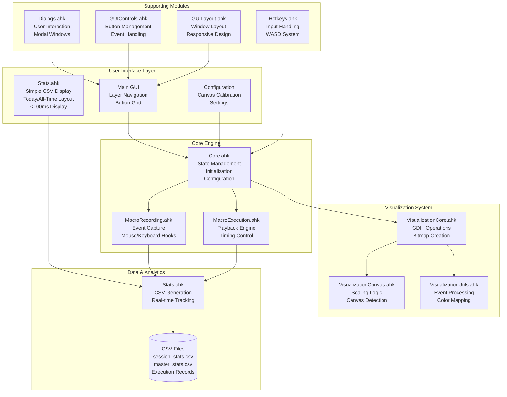

---

## Module Dependencies

### Core Dependencies

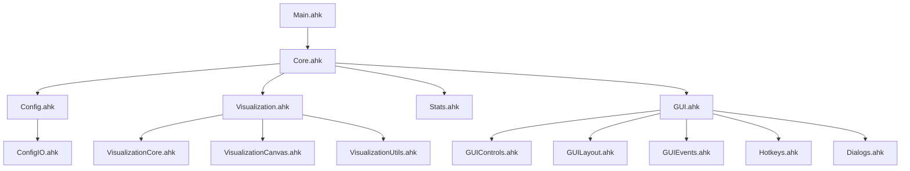

### Runtime Dependencies

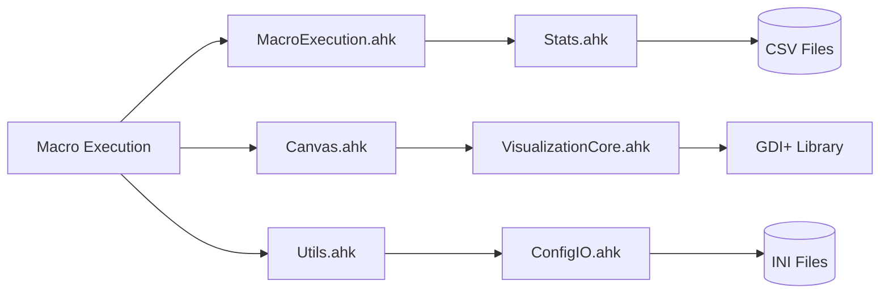

---

## Data Flow Architecture

### Macro Recording Flow

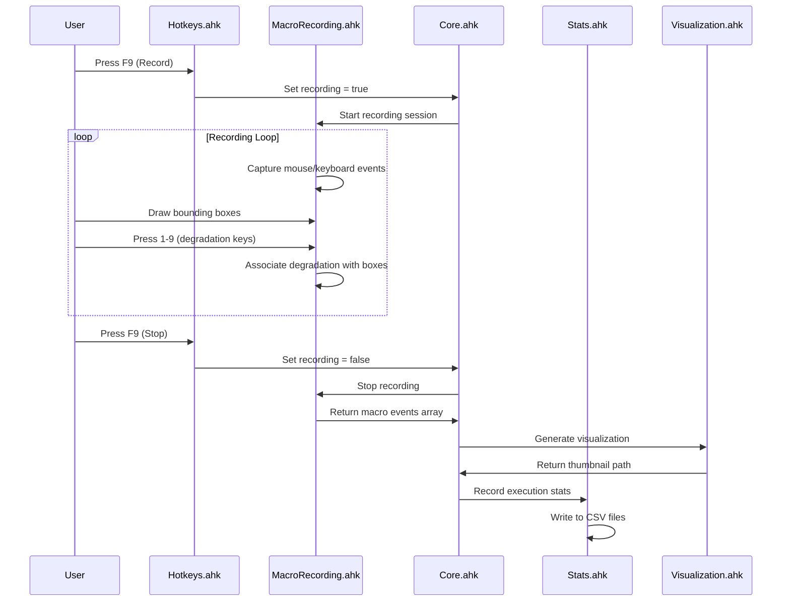

### Macro Playback Flow

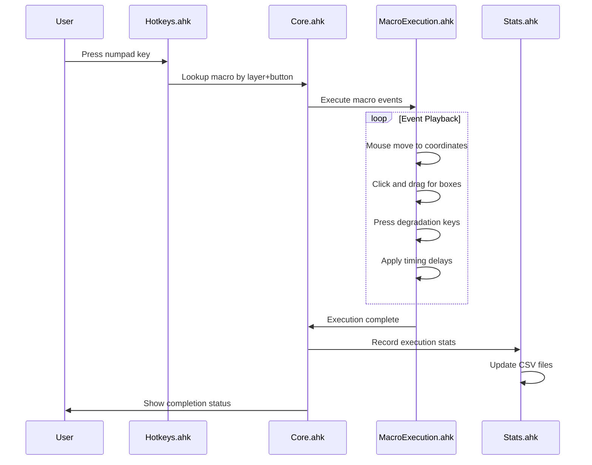

### Statistics Display Flow

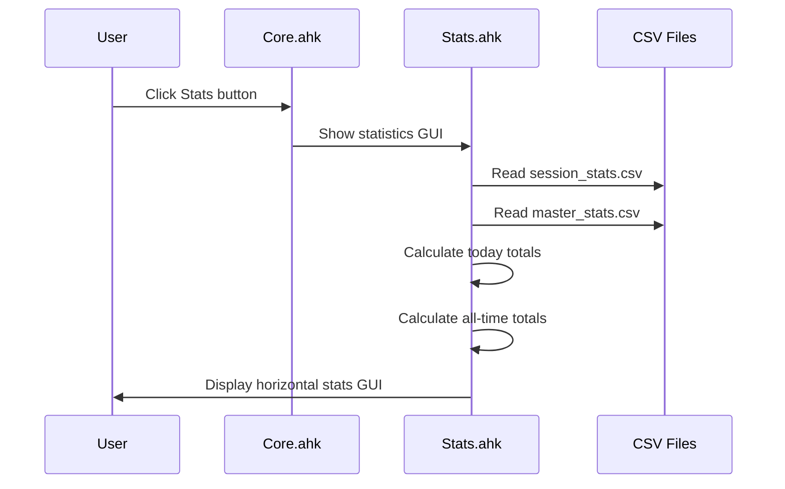

---

## State Management Architecture

### Global State Variables

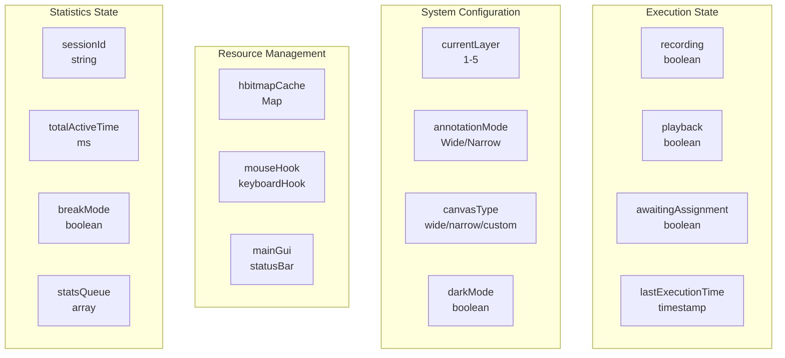

### State Transitions

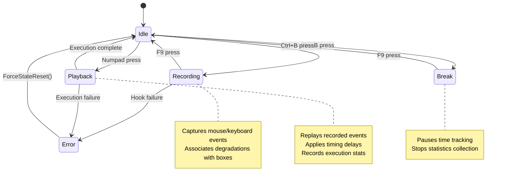

---

## Visualization Pipeline

### Three-Tier Visualization System

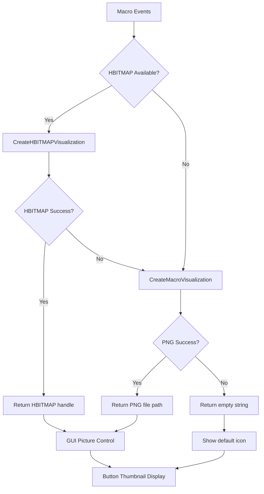

### Canvas Detection & Scaling

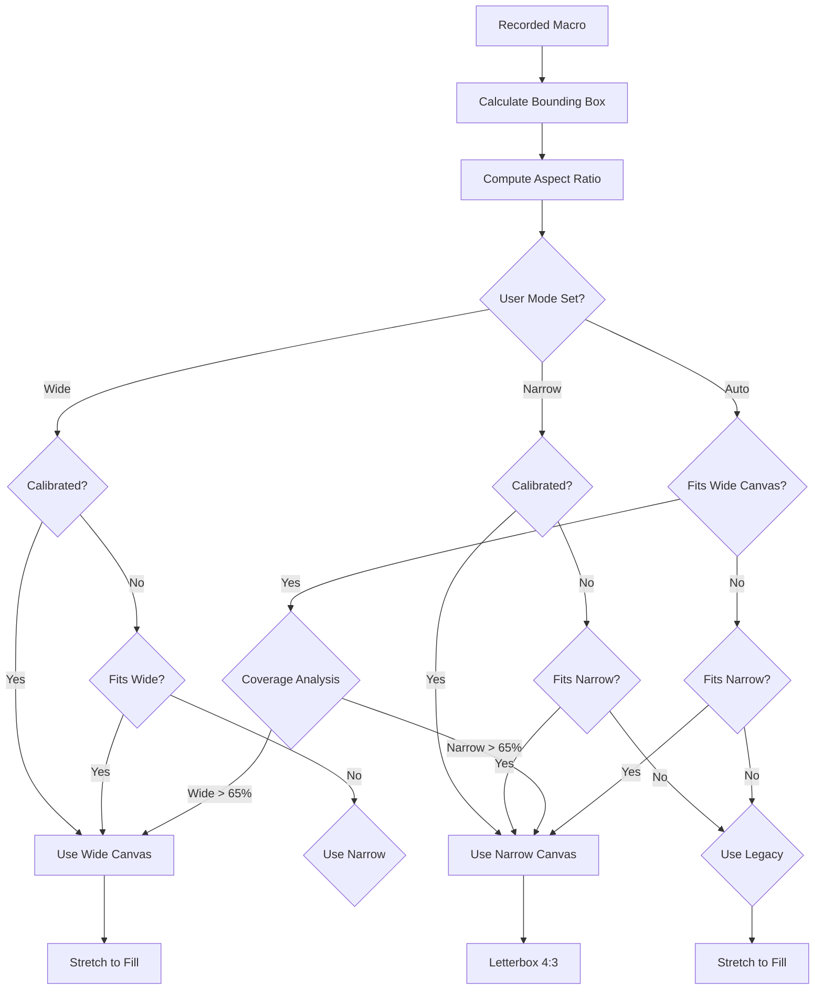

---

## Data Storage Architecture

### Multi-Layer Storage System

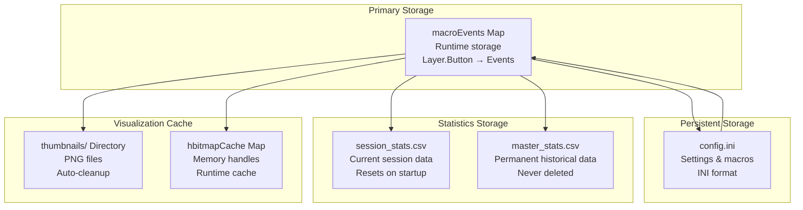

### CSV Data Format

**Session Stats CSV (session_stats.csv):**
```csv
timestamp,session_id,button_key,layer,execution_time_ms,total_boxes,smudge,glare,splashes,partial_blockage,full_blockage,light_flare,rain,haze,snow
```

**Master Stats CSV (master_stats.csv):**
- Same format as session_stats.csv
- Permanent historical record
- Never reset or deleted
- Appended to with each execution

**Key Fields:**
- `timestamp`: ISO 8601 datetime
- `session_id`: UUID for session tracking
- `button_key`: Numpad key name (e.g., "NumpadDot")
- `layer`: Layer number (1-5)
- `execution_time_ms`: Macro execution duration
- `total_boxes`: Number of boxes drawn
- `smudge` through `snow`: Count of each degradation type (9 types)

---

## Error Handling & Recovery

### Error Handling Architecture

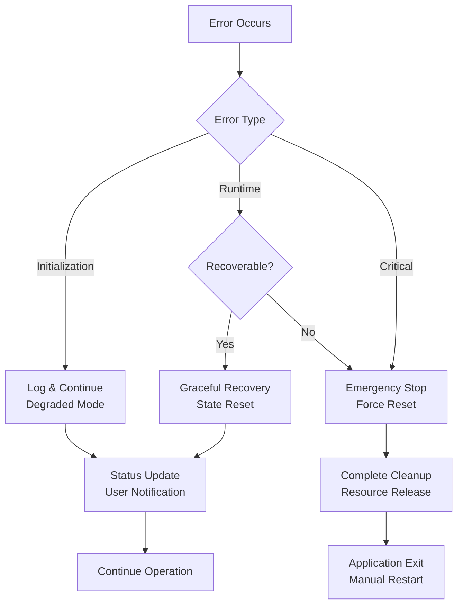

### Recovery Mechanisms

- **State Reset**: `ForceStateReset()` clears stuck states
- **Emergency Stop**: `EmergencyStop()` halts all activity
- **Resource Cleanup**: `CleanupAndExit()` releases handles
- **Configuration Validation**: Periodic integrity checks
- **Fallback Paths**: Multiple storage locations
- **Silent Degradation**: Continue with reduced functionality

---

## Performance Characteristics

### Performance Metrics

| Component | Operation | Typical Time | Notes |
|-----------|-----------|---------------|-------|
| **Visualization** | HBITMAP creation | <1ms cached, 5-10ms new | Per button |
| | PNG generation | 15-30ms | File I/O overhead |
| | Canvas detection | <1ms | Aspect ratio calculation |
| **Execution** | Macro playback | 50-500ms | Depends on complexity |
| | Stats recording | <10ms | CSV write |
| **Statistics** | CSV read/parse | <50ms | Per file |
| | Stats GUI display | <100ms | Calculation + rendering |
| **Initialization** | Cold start | 2-5s | First launch |
| | Warm start | <1s | Subsequent launches |

### Memory Usage

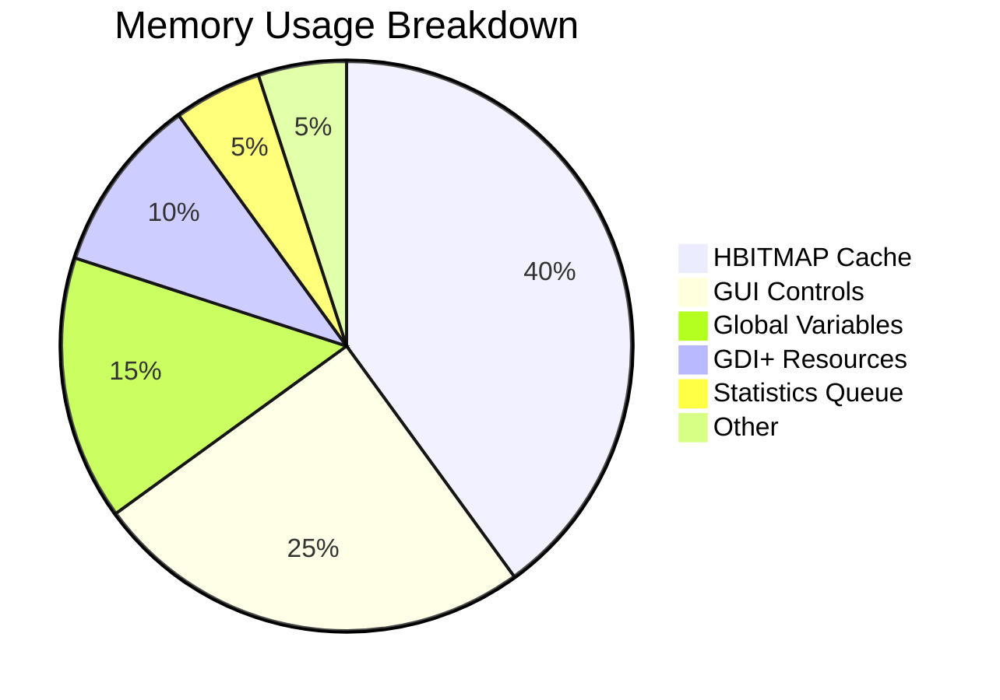

### Scalability Considerations

- **Macro Count**: Handles 1000+ macros per layer
- **Execution History**: Efficient CSV parsing for large datasets
- **Visualization Cache**: Automatic cleanup prevents bloat
- **Session Length**: Optimized for 8+ hour labeling sessions
- **Concurrent Operations**: Single-threaded design, no race conditions

---

## Security & Corporate Compatibility

### Corporate Environment Features

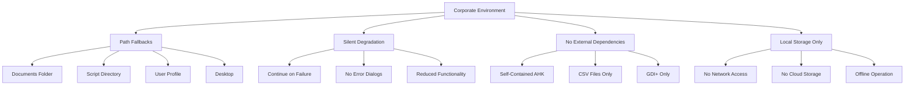

### Security Measures

- **No Network Communication**: All operations local
- **No External Executables**: Pure AutoHotkey v2.0
- **Safe File Operations**: Atomic writes with backups
- **Input Validation**: Bounds checking on all coordinates
- **Resource Limits**: Memory and file size constraints
- **Error Containment**: Failures don't compromise system state

---

## Development & Maintenance

### Code Organization

```
src/
├── Core.ahk              # System foundation
├── Main.ahk              # Entry point
├── *-recording related-  # Recording functionality
├── *-execution related-  # Playback functionality
├── *-visualization-*     # Graphics and thumbnails
├── *-gui*                # User interface
├── *-stats*              # Analytics and tracking
└── *-utils*              # Helper functions

docs/
├── ARCHITECTURE.md       # This file
├── VISUALIZATION_SYSTEM.md
├── CORE_SYSTEM.md
├── CLAUDE.md            # AI development guide
└── SIMPLE_STATS_SYSTEM.md

data/
├── session_stats.csv    # Current session data
└── master_stats.csv     # Permanent historical data

tests/
└── test_*.ahk          # AHK test scripts
```

### Development Workflow


### Quality Assurance

- **Modular Testing**: Each .ahk file can be tested independently
- **State Validation**: Comprehensive state checking functions
- **Error Simulation**: Built-in failure mode testing
- **Performance Monitoring**: Built-in benchmarking tools
- **Configuration Validation**: Automatic integrity checking

---

## Future Evolution

### Planned Enhancements

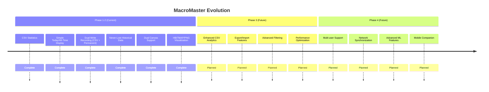

### Scalability Roadmap

- **Phase 3**: Enhanced CSV analytics, export features
- **Phase 4**: Multi-user collaboration features
- **Phase 5**: Network synchronization options
- **Phase 6**: Enterprise deployment tools

---

## Quick Reference

### System Components

| Component | Primary File | Purpose |
|-----------|--------------|---------|
| **Core Engine** | `Core.ahk` | State management, initialization |
| **Recording** | `MacroRecording.ahk` | Event capture, degradation assignment |
| **Playback** | `MacroExecution.ahk` | Macro execution, timing |
| **Visualization** | `Visualization*.ahk` | Thumbnails, canvas handling |
| **Statistics** | `Stats.ahk` | Data collection, CSV storage, GUI display |
| **GUI** | `GUI*.ahk` | User interface, controls |

### Key Hotkeys

| Hotkey | Function | Module |
|--------|----------|--------|
| `F9` | Toggle recording | `Hotkeys.ahk` |
| `Ctrl+B` | Break mode | `Core.ahk` |
| `Numpad 0-9` | Execute macros | `Hotkeys.ahk` |
| `Shift+Enter` | Submit image | `Core.ahk` |
| `RCtrl` | Emergency stop | `Core.ahk` |

### File Locations

| Type | Location | Purpose |
|------|----------|---------|
| **Configuration** | `Documents\MacroMaster\data\config.ini` | Settings & macros |
| **Session Stats** | `Documents\MacroMaster\data\session_stats.csv` | Current session data |
| **Historical Stats** | `Documents\MacroMaster\data\master_stats.csv` | Permanent execution history |
| **Thumbnails** | `Documents\MacroMaster\thumbnails\` | Button images |

---

**Document Maintained By:** MacroMaster Architecture Team
**Last Review:** 2025-10-08
**Next Review:** 2025-11-08