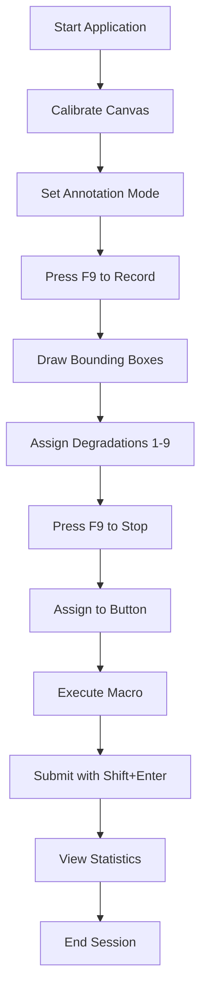

# MacroMaster Usage Guide & Troubleshooting

**Version:** 2.0
**Last Updated:** 2025-10-08
**Status:** Production Ready

---

## Table of Contents

1. [Quick Start](#quick-start)
2. [Basic Workflow](#basic-workflow)
3. [Advanced Features](#advanced-features)
4. [Configuration](#configuration)
5. [Troubleshooting](#troubleshooting)
6. [Performance Optimization](#performance-optimization)
7. [Corporate Environment Setup](#corporate-environment-setup)
8. [Best Practices](#best-practices)

---

## Quick Start

### System Requirements

- **Windows 10/11**
- **AutoHotkey v2.0** (installed and in PATH)
- **50 MB free disk space**

### Installation

1. **Extract the MacroMaster archive** to any directory
2. **Run the application:**
   ```bash
   "C:\Program Files\AutoHotkey\v2\AutoHotkey.exe" src/Main.ahk
   ```

### First Run Setup

1. **Canvas Calibration** (prompted automatically)
   - Click "Calibrate Canvas" button
   - Draw a rectangle around your labeling area
   - Save calibration

2. **Test Recording**
   - Press `F9` to start recording
   - Draw some bounding boxes
   - Press `1-9` to assign degradations
   - Press `F9` to stop recording
   - Press numpad key to assign macro

3. **Test Playback**
   - Press assigned numpad key
   - Watch macro replay
   - Press `Shift+Enter` to submit

---

## Basic Workflow

### Complete Labeling Session



### Step-by-Step Guide

#### 1. Canvas Setup

**Wide Mode (16:9 screens):**
```autohotkey
; Click "Wide" mode button
; Calibrate wide canvas area
; Macros will stretch to fill thumbnails
```

**Narrow Mode (4:3 with side panels):**
```autohotkey
; Click "Narrow" mode button
; Calibrate narrow canvas area
; Macros will show with letterboxing
```

#### 2. Macro Recording

**Start Recording:**
- Press `F9` or click record button
- Status shows: "🎥 Recording - Draw boxes, press 1-9 for degradation"

**Draw Boxes:**
- Click and drag to create bounding boxes
- Each box represents a labeled region

**Assign Degradations:**
- Press `1` = smudge (orange)
- Press `2` = glare (gold)
- Press `3` = splashes (purple)
- Press `4` = partial blockage (green)
- Press `5` = full blockage (red)
- Press `6` = light flare (pink)
- Press `7` = rain (brown)
- Press `8` = haze (gray)
- Press `9` = snow (teal)

**Stop Recording:**
- Press `F9` again
- Status shows: "⏹️ Recording stopped - Assign to button"

#### 3. Macro Assignment

**Assign to Button:**
- Press numpad key (0-9, ., *)
- Macro stored as "L{currentLayer}_{buttonName}"
- Thumbnail appears on button

**Layer Management:**
- Use numpad `/` and `-` to change layers
- 5 layers available (Base, Advanced, Tools, Custom, AUTO)
- Layer indicator shows current layer

#### 4. Macro Execution

**Execute Macro:**
- Press assigned numpad key
- Watch automated playback
- Timing delays ensure accuracy

**Special Functions:**
- `Shift + numpad key` = Clear execution (no degradation)
- `Numpad Enter` = Direct clear submission
- `Shift + Enter` = Submit current image

### Statistics Tracking

**View Statistics:**
- Click "Stats" button or press stats hotkey
- Displays Today/All-Time statistics in AutoHotkey GUI
- Shows degradation counts, execution metrics, time tracking

**Statistics Display:**
- Today: Current session statistics
- All-Time: Permanent historical data
- Horizontal layout with clear separation
- Real-time updates after each execution

---

## Advanced Features

### Layer System

#### Layer Purposes

| Layer | Purpose | Use Case |
|-------|---------|----------|
| **1 (Base)** | Fundamental macros | Basic labeling patterns |
| **2 (Advanced)** | Complex workflows | Multi-step processes |
| **3 (Tools)** | Utility functions | Repetitive tasks |
| **4 (Custom)** | User defined | Personal workflows |
| **5 (AUTO)** | Automated sequences | Unattended processing |

#### Layer Navigation

```autohotkey
; Hotkeys
NumpadDiv   ; Previous layer
NumpadSub   ; Next layer

; GUI
Layer indicator shows current layer
Layer buttons for direct access
```

### JSON Annotation System

#### Layer 6 (JSON Profiles)

**Pre-built Profiles:**
- `L6_Num7` to `L6_Num3`: High severity degradations
- `L6_Num0` to `L6_NumMult`: Medium severity degradations

**Usage:**
```autohotkey
; Assign JSON profile to button
; Execute like regular macro
; Automatically exports to labeling system format
```

#### Custom JSON Creation

**Format:**
```json
{
  "is3DObject": false,
  "segmentsAnnotation": {
    "attributes": {
      "severity": "high"
    },
    "track_id": 1,
    "type": "bbox",
    "category_id": 1,
    "points": [[x1,y1], [x2,y2]]
  }
}
```

### Break Mode & Time Tracking

#### Break Mode
```autohotkey
; Toggle break mode
Ctrl + B

; Effects:
; - Pauses time tracking
; - Stops statistics collection
; - Preserves macro assignments
; - Shows break indicator
```

#### Time Metrics

**Tracked Metrics:**
- Total active time (productive labeling)
- Session duration
- Boxes per hour productivity
- Execution speed statistics

### WASD Hotkey System

#### Activation
```autohotkey
; Enable WASD hotkeys (default: enabled)
; Use CapsLock + WASD keys for navigation

CapsLock + W  ; Up
CapsLock + A  ; Left
CapsLock + S  ; Down
CapsLock + D  ; Right

CapsLock + Q  ; Additional functions
CapsLock + E  ; Additional functions
CapsLock + Z  ; Additional functions
CapsLock + C  ; Additional functions
CapsLock + X  ; Additional functions
```

#### Configuration
```autohotkey
; Toggle WASD system
Click "WASD" toggle button

; Profile active by default
hotkeyProfileActive := true
```

### Automated Execution

#### Setup Auto Execution
```autohotkey
; Right-click button → Auto Settings
; Set interval (seconds)
; Set max executions (0 = infinite)
; Click "Start Auto" button
```

#### Auto Execution Features
- Configurable intervals (5-300 seconds)
- Execution counting and limits
- Memory cleanup every 50 executions
- Visual indicators (yellow outlines)
- Emergency stop capability

---

## Configuration

### Settings Files

#### config.ini Location
```
C:\Users\{username}\Documents\MacroMaster\data\config.ini
```

#### Key Settings

**Timing Configuration:**
```ini
[Settings]
boxDrawDelay=75
mouseClickDelay=85
keyPressDelay=20
focusDelay=80
```

**Hotkey Configuration:**
```ini
hotkeyRecordToggle=F9
hotkeySubmit=+Enter
hotkeyBreakMode=^b
hotkeyEmergency=RCtrl
```

**Canvas Configuration:**
```ini
[Canvas]
wideCanvasLeft=0
wideCanvasTop=0
wideCanvasRight=1920
wideCanvasBottom=1080

narrowCanvasLeft=240
narrowCanvasTop=0
narrowCanvasRight=1680
narrowCanvasBottom=1080
```

### Runtime Configuration

#### Change Settings
```autohotkey
; Access settings menu
Click gear icon or use hotkey

; Modify timing values
; Change hotkeys
; Adjust canvas boundaries
; Toggle features on/off
```

#### Import/Export Configuration
```autohotkey
; Export: Copy config.ini file
; Import: Replace config.ini and restart
; Backup: Automatic on save
```

---

## Troubleshooting

### Common Issues & Solutions

#### Issue: Application Won't Start

**Symptoms:** Script fails to load, error messages

**Solutions:**
1. **Check AutoHotkey v2.0 installation:**
   ```cmd
   "C:\Program Files\AutoHotkey\v2\AutoHotkey.exe" --version
   ```

2. **Verify file permissions:**
   - Full access to Documents folder
   - Write permissions for MacroMaster directory

3. **Clean restart:**
   - Delete config.ini (resets to defaults)
   - Clear thumbnails directory
   - Restart application

#### Issue: Black/Empty Thumbnails

**Symptoms:** Button thumbnails don't show macro previews

**Causes:**
- GDI+ initialization failure
- Canvas not calibrated
- Corporate environment restrictions

**Solutions:**
1. **Check GDI+ status:**
   ```autohotkey
   UpdateStatus("GDI+ Initialized: " . gdiPlusInitialized)
   ```

2. **Recalibrate canvas:**
   - Click "Calibrate Canvas" button
   - Draw rectangle around labeling area
   - Test with simple macro

3. **Check corporate mode:**
   - System falls back to PNG if HBITMAP fails
   - Check fallback paths in status messages

#### Issue: Macros Not Playing Back Correctly

**Symptoms:** Wrong coordinates, timing issues, missing clicks

**Causes:**
- Canvas calibration mismatch
- Wrong annotation mode
- Timing configuration issues

**Solutions:**
1. **Verify canvas calibration:**
   - Check current mode (Wide/Narrow)
   - Recalibrate if coordinates seem wrong

2. **Test timing:**
   ```autohotkey
   ; Adjust delays in settings
   boxDrawDelay := 100  ; Increase if too fast
   mouseClickDelay := 100  ; Increase for reliability
   ```

3. **Check coordinate system:**
   - Wide mode: 0-1920, 0-1080
   - Narrow mode: 240-1680, 0-1080

#### Issue: Statistics Not Recording

**Symptoms:** No data in stats display, CSV files empty

**Causes:**
- File permission issues
- Break mode active
- Path configuration problems

**Solutions:**
1. **Check file permissions:**
   ```cmd
   dir "C:\Users\%USERNAME%\Documents\MacroMaster\data"
   ```

2. **Verify break mode:**
   ```autohotkey
   UpdateStatus("Break Mode: " . breakMode)
   ```

3. **Check CSV files exist:**
   ```cmd
   type "C:\Users\%USERNAME%\Documents\MacroMaster\data\session_stats.csv"
   type "C:\Users\%USERNAME%\Documents\MacroMaster\data\master_stats.csv"
   ```

#### Issue: Slow Performance

**Symptoms:** Delays, freezing, high memory usage

**Causes:**
- Large HBITMAP cache
- Complex macros
- Memory leaks

**Solutions:**
1. **Clear visualization cache:**
   ```autohotkey
   CleanupHBITMAPCache()
   UpdateStatus("Cache cleared")
   ```

2. **Optimize macro complexity:**
   - Reduce number of boxes per macro
   - Simplify mouse movements

3. **Check memory usage:**
   ```autohotkey
   UpdateStatus("HBITMAP cache size: " . hbitmapCache.Count)
   ```

#### Issue: Stats Display Not Showing

**Symptoms:** Stats button doesn't work, GUI shows no data

**Causes:**
- CSV files missing or corrupted
- File permission issues
- Break mode preventing stats collection

**Solutions:**
1. **Check CSV files exist:**
   ```cmd
   dir "C:\Users\%USERNAME%\Documents\MacroMaster\data\*.csv"
   ```

2. **Verify CSV content:**
   ```cmd
   type "C:\Users\%USERNAME%\Documents\MacroMaster\data\session_stats.csv"
   type "C:\Users\%USERNAME%\Documents\MacroMaster\data\master_stats.csv"
   ```

3. **Test stats collection:**
   - Execute a macro
   - Check that CSV files are updated with new entries
   - Verify timestamps are current

### Debug Procedures

#### System Health Check

```autohotkey
; Run comprehensive system check
UpdateStatus("=== SYSTEM HEALTH CHECK ===")
UpdateStatus("GDI+: " . gdiPlusInitialized)
UpdateStatus("Canvas Calibrated: " . (isCanvasCalibrated ? "Yes" : "No"))
UpdateStatus("Recording: " . recording)
UpdateStatus("Playback: " . playback)
UpdateStatus("Break Mode: " . breakMode)
UpdateStatus("Current Layer: " . currentLayer)
UpdateStatus("Macros Loaded: " . CountLoadedMacros())
UpdateStatus("HBITMAP Cache: " . hbitmapCache.Count)
UpdateStatus("Session ID: " . sessionId)
UpdateStatus("=== END CHECK ===")
```

#### Emergency Recovery

```autohotkey
; Complete system reset
EmergencyStop()
CleanupHBITMAPCache()
SaveConfig()
ForceStateReset()
UpdateStatus("System reset complete - please restart")
```

#### Log Analysis

**Check Status Messages:**
- Look for error indicators (❌, ⚠️)
- Note canvas detection results
- Monitor cache sizes

**File System Checks:**
```cmd
dir "C:\Users\%USERNAME%\Documents\MacroMaster\data"
type "C:\Users\%USERNAME%\Documents\MacroMaster\data\config.ini"
```

---

## Performance Optimization

### System Tuning

#### Optimal Settings for Speed

```autohotkey
; Fast execution settings
boxDrawDelay := 50
mouseClickDelay := 60
mouseMoveDelay := 10
keyPressDelay := 15
focusDelay := 30
```

#### Optimal Settings for Accuracy

```autohotkey
; Reliable execution settings
boxDrawDelay := 100
mouseClickDelay := 120
mouseMoveDelay := 20
keyPressDelay := 25
focusDelay := 100
```

### Memory Management

#### Cache Optimization

```autohotkey
; Monitor cache size
if (hbitmapCache.Count > 500) {
    CleanupHBITMAPCache()
    UpdateStatus("Cache optimized")
}
```

#### Chrome Memory Cleanup

```autohotkey
; Automatic cleanup every 50 executions
if (chromeMemoryCleanupCount >= chromeMemoryCleanupInterval) {
    ; Force garbage collection in Chrome
    chromeMemoryCleanupCount := 0
}
```

### CSV File Optimization

#### File Maintenance

```cmd
; Check CSV file sizes
dir "C:\Users\%USERNAME%\Documents\MacroMaster\data\*.csv"

; Archive old session data if needed
copy session_stats.csv session_stats_backup.csv
echo timestamp,session_id,username,execution_type > session_stats.csv
```

#### Data Management

- Session stats reset daily (session_stats.csv)
- Permanent history in master_stats.csv
- Simple CSV format for easy analysis
- Open with Excel or any CSV viewer

---

## Corporate Environment Setup

### Restricted Environment Configuration

#### Path Fallbacks

**Automatic Fallback Order:**
1. `Documents\MacroMaster\` (preferred)
2. `Script directory\MacroMaster\`
3. `Documents\MacroMaster_fallback\`
4. `UserProfile\MacroMaster\`
5. `Desktop\MacroMaster\`

#### Permission Requirements

**Minimum Permissions:**
- Read/write to working directory
- Create subdirectories
- Execute AutoHotkey scripts
- Create CSV files

#### Network Isolation

**Offline Features:**
- No internet required for core functionality
- Local CSV file storage
- All data stored in plain text CSV format
- No telemetry or cloud features

### Enterprise Deployment

#### Group Policy Considerations

**Allow Rules:**
- AutoHotkey v2.0 execution
- CSV file creation in user directories
- GDI+ graphics operations

**Block Rules (if needed):**
- Network access from application
- External executable downloads
- Cloud storage integration

#### Multi-User Setup

**Per-User Installation:**
- Each user gets separate data directory
- No shared configuration
- Individual statistics tracking
- Isolated macro storage

---

## Best Practices

### Workflow Optimization

#### Session Management

1. **Start with calibration check**
2. **Set appropriate annotation mode**
3. **Use layers for organization**
4. **Take regular breaks (use break mode)**
5. **Review statistics daily**

#### Macro Design

1. **Keep macros focused** (single purpose)
2. **Use consistent degradation assignment**
3. **Test playback before heavy use**
4. **Document complex macro purposes**
5. **Regular cleanup of unused macros**

### Quality Assurance

#### Testing Protocols

**Daily Checks:**
- Canvas calibration accuracy
- Macro playback reliability
- Statistics data integrity
- System performance metrics

**Weekly Reviews:**
- Statistics trends analysis
- Macro usage patterns
- Performance optimization opportunities

#### Backup Strategy

**Automatic Backups:**
- Configuration saved every 30 seconds
- Statistics written to CSV files
- Session and permanent history files

**Manual Backups:**
```cmd
copy "config.ini" "config_backup.ini"
copy "session_stats.csv" "session_stats_backup.csv"
copy "master_stats.csv" "master_stats_backup.csv"
```

### Training & Documentation

#### User Training

**New User Checklist:**
- [ ] Complete canvas calibration
- [ ] Learn degradation types (1-9 keys)
- [ ] Practice recording/playback cycle
- [ ] Review statistics display
- [ ] Understand break mode usage

**Advanced User Skills:**
- [ ] Layer system mastery
- [ ] JSON profile usage
- [ ] Auto execution setup
- [ ] Performance optimization
- [ ] Troubleshooting procedures

---

## Quick Reference

### Hotkey Summary

| Hotkey | Function | Context |
|--------|----------|---------|
| `F9` | Toggle recording | Always |
| `Ctrl+B` | Break mode | Always |
| `Numpad 0-9,.,*` | Execute macro | GUI active |
| `Shift+Numpad` | Clear execution | GUI active |
| `Shift+Enter` | Submit image | Browser focus |
| `Numpad /` | Previous layer | GUI active |
| `Numpad -` | Next layer | GUI active |
| `RCtrl` | Emergency stop | Always |
| `CapsLock+WASD` | Navigation | WASD enabled |

### Status Indicators

| Icon | Meaning | Action |
|------|---------|--------|
| 🎥 | Recording active | Draw boxes, assign degradations |
| ⏹️ | Recording stopped | Assign to button |
| ▶️ | Playback active | Wait for completion |
| ⏸️ | Break mode active | Time tracking paused |
| ⚠️ | Warning condition | Check status message |
| ❌ | Error condition | See troubleshooting |
| ✅ | Operation successful | Continue normal workflow |

### File Locations

| File/Type | Location | Purpose |
|-----------|----------|---------|
| **Application** | `src/Main.ahk` | Main executable |
| **Configuration** | `Documents\MacroMaster\data\config.ini` | Settings & macros |
| **Session Stats** | `Documents\MacroMaster\data\session_stats.csv` | Current session data |
| **Master Stats** | `Documents\MacroMaster\data\master_stats.csv` | Permanent history |
| **Thumbnails** | `Documents\MacroMaster\thumbnails\` | Button images |
| **Logs** | `Documents\MacroMaster\data\offline_log.txt` | Error logging |

---

## Support Resources

### Documentation

- `docs/ARCHITECTURE.md` - System design overview
- `docs/VISUALIZATION_SYSTEM.md` - Graphics and thumbnails
- `docs/CORE_SYSTEM.md` - Core functionality
- `stats/STATS_SYSTEM_DOCUMENTATION.md` - Analytics system

### Community Resources

**For questions:**
- Check status messages for error details
- Review statistics display for usage patterns
- Test with simple macros first

**For issues:**
- Run system health check
- Check file permissions
- Verify dependencies installed
- Use emergency recovery procedures

---

**Document Maintained By:** MacroMaster User Experience Team
**Last Review:** 2025-10-08
**Next Review:** 2025-11-08